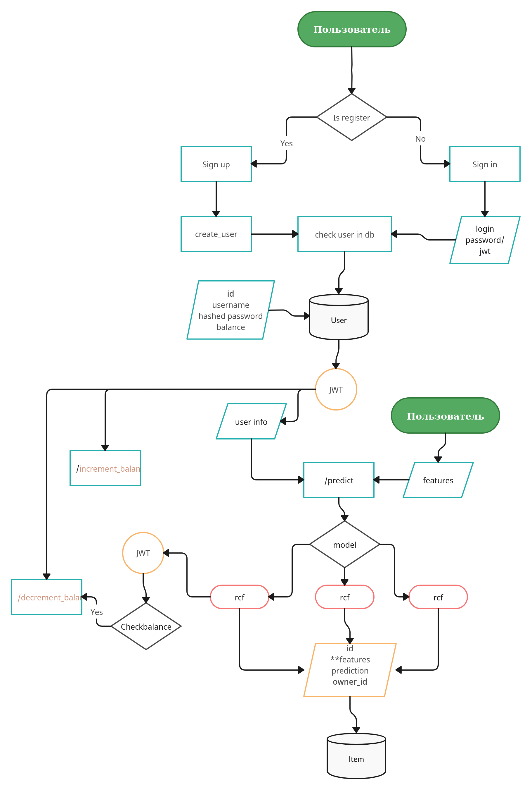

# 1. Цели и предпосылки
## 1.1. Зачем идем в разработку продукта?

**Бизнес-цель:** Создание модели машинного обучения для классификации глиомы мозга на LGG и GBM, что повысит точность диагностики и позволит оптимизировать планы лечения пациентов.

## 1.2. Бизнес-требования и ограничения

**Краткое описание БТ:** Разработка точной и надежной модели для классификации глиомы на основе генетических и клинических данных с использованием методов машинного обучения.

## 1.3. Что входит в скоуп проекта/итерации, что не входит

На закрытие каких БТ подписываемся в данной итерации: Разработка и тестирование нескольких моделей классификации, включая **Ridge Classifier**, **LDA**, **Naive Bayes**, и другие. Проведение EDA и оптимизация моделей на основе метрик.

## 1.4. Предпосылки решения

**Описание предпосылок:** Использование данных проектов TCGA-LGG и TCGA-GBM, включающих 20 генетических мутаций и 3 клинических признака. Прогнозирование основано на анализе этих данных с целью классификации глиомы.

# 2. Методология
## 2.1. Постановка задачи

**Что делаем с технической точки зрения:** Разработка модели машинного обучения для классификации глиомы мозга, анализ данных, выбор и оптимизация моделей.

## 2.2. Блок-схема решения

Блок-схема: 

## 2.3. Этапы решения задачи

Для каждого этапа по результатам EDA: Подготовка данных, выбор и сравнение моделей, оценка эффективности, тестирование моделей, внедрение лучшей модели.

# 3. Подготовка пилота
## 3.1. Способ оценки пилота

Краткое описание: Оценка на основе метрик Accuracy, AUC, Recall, Precision, F1-Score, Kappa и MCC.

## 3.2. Что считаем успешным пилотом

Формализованные метрики: Модель, превосходящая остальные по ключевым метрикам, особенно по Accuracy и F1-Score.

# 4. Внедрение
## 4.1. Архитектура решения

Блок схема и пояснения: Модель будет интегрирована в виде REST API с использованием FastAPI, упакована в Docker контейнеры для удобства развертывания и масштабирования.

## 4.2. Описание инфраструктуры и масштабируемости

Инфраструктура: Docker и Kubernetes для обеспечения гибкости и масштабируемости решения.

## 4.3. Риски

Описание рисков: Риск переобучения модели, особенно в случае использования сложных моделей, таких как Gradient Boosting Classifier. Необходимо использовать методы валидации и аугментации данных для минимизации риска.
